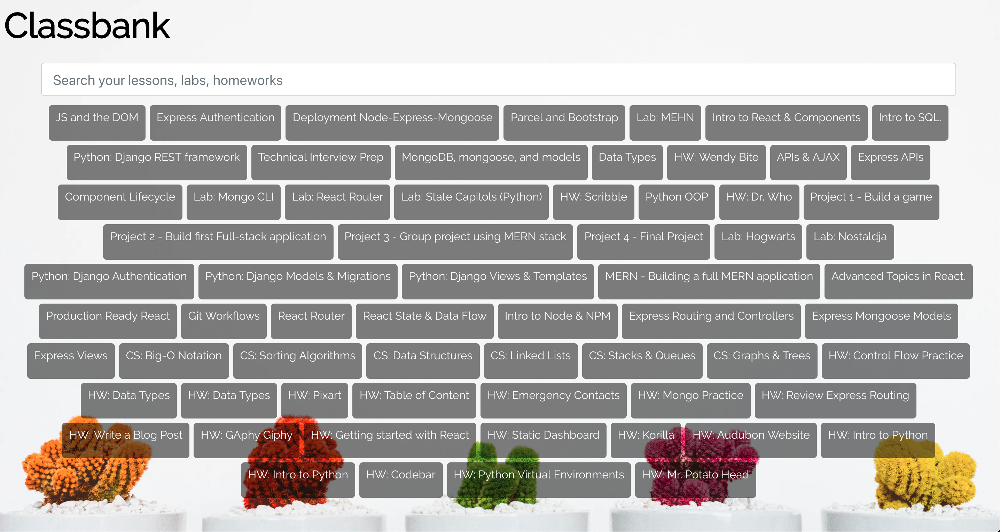

# Classbank - API

## API (Back-end)

This is the back-end repository for a full-stack application called Classbank. Click [here](https://classbank.herokuapp.com/lesson
) for API access.

### Front End

You can find the front-end repository [here](https://github.com/pistolphat/Classbank).

Here is the deployed [website](http://classbank.surge.sh).



## Technology Used

This full stack application utilized M.E.R.N stack.

- Back-end
  - Node.js
  - Express
  - MongoDB / Mongoose
  - CORS (Cross-Origin Resource Sharing)

* Postman - for testing CRUD functionality

* Heroku & MLABS (Back-end Deployment)

## User Stories

** User will need proper credentials in order to be redirect onto GA's repositories.

A User can view all links being pulled from API.

A User can add, update, or delete an entry. (Work in progress)

## Getting Started

To get started, ```clone``` this repository and ```cd``` into this new directory.

1. Install the dependencies using:  ```npm install```
2. Make sure to enable your server in the background:  ```mongod```
3. To access the data, seed the data using the command:  ```node db/seed.js```
4. To launch the application using the command:  ```node index.js```